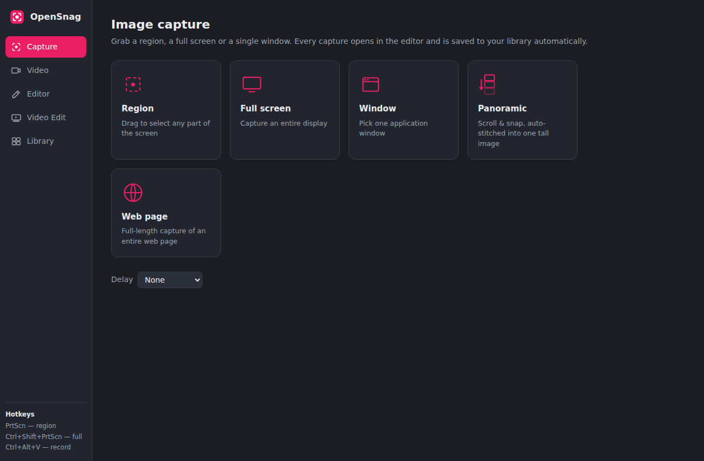
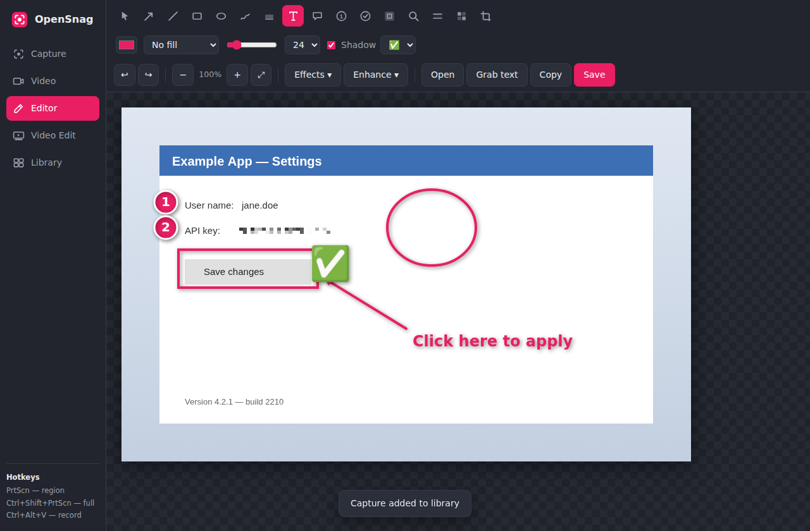
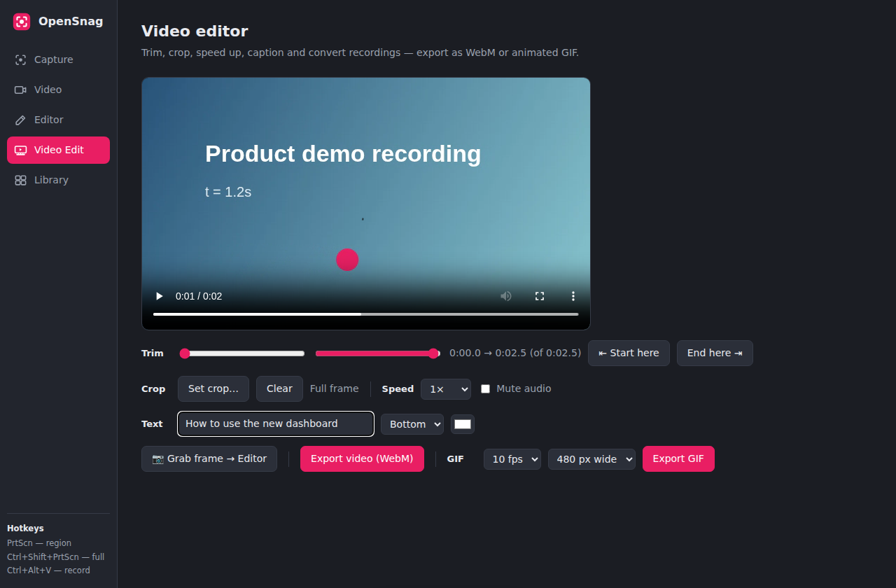

# OpenSnag

A **free, open-source, installable** screen capture and recording tool with a built-in
image editor and video editor — an alternative to
[TechSmith SnagIt](https://www.techsmith.com/snagit/).
Runs locally on **Windows, macOS and Linux** (built with Electron). No account, no
subscription, no telemetry. OCR included, fully offline.





## Features

### Image capture
- **Region capture** — full-screen freeze-frame overlay with crosshair, live pixel
  dimensions and drag-to-select (like SnagIt's all-in-one capture)
- **Full screen capture** — with a display picker on multi-monitor setups
- **Window capture** — pick any open application window from a thumbnail grid
- **Panoramic (scrolling) capture** — select a region, scroll the target app and
  hit *Snap* for each section; the frames are auto-stitched into one tall image
  (coarse + pixel-perfect fine seam matching)
- **Web page capture** — enter a URL, get a full-length screenshot of the entire page
- **Timed capture** — 3 / 5 / 10-second delay to set up menus and tooltips
- **Global hotkeys** — `PrtScn` (region), `Ctrl+Shift+PrtScn` (full screen),
  `Ctrl+Alt+V` (start/stop recording); `Ctrl+Alt+R` / `Ctrl+Alt+F` as fallbacks
- **Tray icon** — the app keeps running in the background; closing the window
  minimizes to the tray, just like SnagIt's capture widget

### Video capture
- Record any **screen or window** to WebM (VP9, 30 fps, high bitrate)
- **Microphone narration** (toggle) and **system audio** on Windows (loopback)
- **Pause / resume**, live recording timer, instant in-app playback
- One click from a finished recording into the **video editor**

### Image editor
Annotations stay editable (select / move / resize / recolor / delete) until export.

| Tool | Description |
|------|-------------|
| Select | move, resize or restyle any annotation; double-click to edit text |
| Arrow / Line | SnagIt-style arrows, `Shift` snaps to 45° |
| Rectangle / Ellipse | outline, solid or translucent fill, optional drop shadow |
| Pen | smooth freehand drawing |
| Highlighter | translucent multiply highlight |
| Text | multi-line text in any color/size |
| Callout | speech-bubble with a draggable tail |
| Step numbers | auto-incrementing numbered badges for tutorials |
| Stamp | emoji stamps (✅ ❌ ⚠️ ⭐ 👍 🔥 💡 …) |
| Spotlight | dim everything outside a region to focus attention |
| Magnifier | zoomed-in lens over fine detail |
| Blur | pixelate/redact sensitive info (passwords, keys, faces) |
| Cut out | remove a horizontal or vertical band and join the halves |
| Crop | drag to crop the image |

**Enhance panel** — live-preview brightness, contrast, saturation, hue, soften
(blur) and sharpen, applied non-destructively until you hit *Apply* (undoable).

**Effects** — border, drop shadow, rounded corners, rotate, flip, grayscale,
**caption bar**, diagonal **watermark**, and resize.

**Grab text (OCR)** — extract all text from the current image with one click.
Powered by Tesseract, bundled with the app: works completely offline.

Also: open any image from disk (button or **drag & drop onto the window**),
50-level undo/redo, zoom (`Ctrl` + wheel, fit-to-window), save as PNG/JPEG
(`Ctrl+S`), copy to clipboard (`Ctrl+C`).

### Video editor
Open any recording (from the recorder, the library, or a file on disk) and:
- **Trim** — sliders or "start/end here" at the playhead, with looping preview
- **Crop** — drag a rectangle straight over the video
- **Speed** — 0.5× / 1× / 1.5× / 2× (audio follows)
- **Mute** and **text overlay** (top/bottom caption in any color)
- **Grab frame** — send the current frame to the image editor at full resolution
- **Export WebM** — re-encoded with all edits applied
- **Export animated GIF** — 5/10/15 fps, 320/480/640px or original width,
  encoded by a built-in dependency-free GIF89a encoder

### Library
Every capture, recording and GIF is automatically kept in a local library
(`<user data>/Captures`) with thumbnails — re-open images in the editor, videos
in the video editor, reveal on disk, or delete.

## Install / Run

Requires [Node.js](https://nodejs.org) 18+ only for building; end users just run the installer.

```bash
git clone <this repo>
cd SnagItAlt
npm install

# run from source
npm start

# build installers into ./dist
npm run dist:win     # Windows: NSIS installer (.exe) + portable .exe
npm run dist:mac     # macOS: .dmg (build on a Mac)
npm run dist:linux   # Linux: AppImage + .deb
```

`npm run dist` builds for the current platform. The Windows installer supports
per-user install, desktop + start-menu shortcuts, and a chosen install directory.

### Platform notes
- **Wayland (Linux):** screen capture uses the desktop portal; if sources come up
  empty, launch with `--ozone-platform=x11` or use an X11 session.
- **macOS:** grant *Screen Recording* permission on first use
  (System Settings → Privacy & Security → Screen Recording).
- **System audio capture** is Windows-only (Chromium loopback); on macOS/Linux
  record microphone audio or use a virtual audio device.
- Exported video is WebM (VP9), which plays in every modern browser and player;
  convert to MP4 with ffmpeg if a legacy target requires it.

## Keyboard shortcuts (editor)

`V` select · `A` arrow · `L` line · `R` rectangle · `E` ellipse · `P` pen ·
`H` highlighter · `T` text · `C` callout · `S` step · `I` stamp · `O` spotlight ·
`M` magnifier · `B` blur · `U` cut out · `X` crop ·
`Del` delete selection · `Ctrl+Z`/`Ctrl+Y` undo/redo · `Esc` deselect

## Architecture

```
main.js              Electron main process: tray, global hotkeys, desktopCapturer
                     screenshots, region/panoramic overlays, web-page capture,
                     offline OCR (tesseract.js), library on disk, dialogs
preload.js           contextBridge IPC surface (no nodeIntegration in renderers)
overlay/overlay.*    frameless full-screen region selector (frozen screenshot)
overlay/panel.*      floating Snap/Finish bar for panoramic capture
renderer/app.js      app shell (capture / video / editors / library views)
renderer/editor.js   vector-object image annotation editor + enhance/effects
renderer/videoedit.js video editor (trim/crop/speed/overlays, WebM + GIF export)
renderer/gif.js      dependency-free animated GIF89a encoder (median-cut + LZW)
renderer/stitch.js   panoramic stitcher (downscaled search + full-res refinement)
```

All renderer logic is verified headless in Chromium (43 automated UI checks
covering capture flows, every editor tool, the enhance panel, effects, GIF
encoding round-trip, stitching accuracy, and the full video edit/export pipeline).

## License

MIT — free for personal and commercial use.
